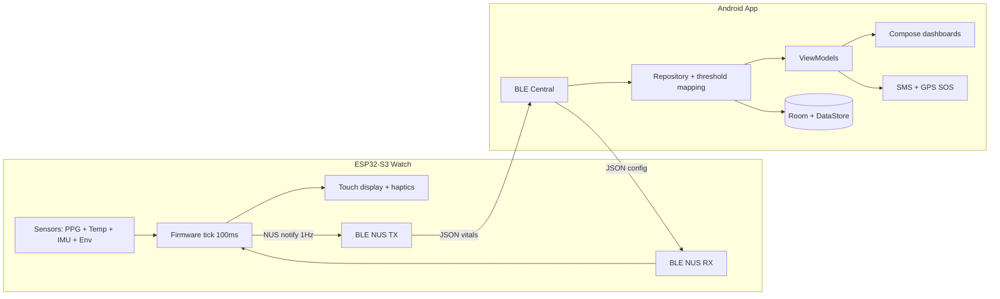

# Architecture

## Data flow

1. Watch reads sensors, derives HR/SpO2/steps/alerts, updates display.
2. Watch notifies JSON vitals packet at ~1 Hz.
3. Phone decodes, maps to UI state, persists profile/contacts/settings locally.
4. Phone writes back config (thresholds, prefs, time sync, user profile).
5. On SOS/fall, phone sends SMS with snapshot + location link.

No server, no MQTT, no FCM in v1.0.
